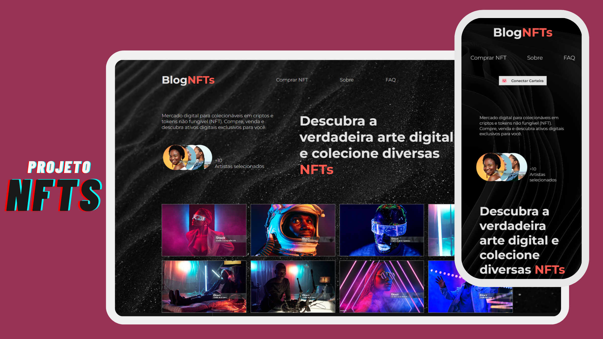

<h1 align="center">#12 NFT's</h1>
<h2 align="center">Blog NFT's</h2>

  Landing page completa sobre NFTs.

  <a href="#-tecnologias">Tecnologias</a>&nbsp;&nbsp;&nbsp;|&nbsp;&nbsp;&nbsp;
  <a href="#-projeto">Projeto</a>&nbsp;&nbsp;&nbsp;|&nbsp;&nbsp;&nbsp;
  <a href="#-layout">Layout</a>&nbsp;&nbsp;&nbsp;|&nbsp;&nbsp;&nbsp;

  

 

  

## 🚀 Tecnologias
- HTML: Linguagem de marcação para estruturar o conteúdo da página.
- CSS: Estilização do site, incluindo folhas de estilo específicas para dispositivos móveis.
- Bootstrap Icons: Ícones utilizados no projeto, provenientes da biblioteca Bootstrap Icons.
- JavaScript: Implementado para interações dinâmicas na página.
- Figma e Canva para layout.

## 💻 Projeto
O Blog NFTs é um site dedicado ao universo dos tokens não fungíveis (NFTs), proporcionando uma experiência única para entusiastas e colecionadores. Com um design responsivo e atraente, o site oferece informações sobre o mercado digital de colecionáveis em criptomoedas, permitindo que os usuários comprem, vendam e descubram ativos digitais exclusivos.

#### Header:
- Logo: Apresenta o nome do blog junto com uma xícara de café estilizada.
- Menu de Navegação: Inclui links para seções importantes, como "Comprar NFT", "Sobre" e "FAQ".
- Botão de Conectar Carteira: Oferece aos usuários a opção de se conectar à sua carteira digital.

#### Seção Inicial:

- Apresenta uma breve descrição do blog, destacando o mercado digital para colecionáveis em criptomoedas.
- Perfil de Artistas: Exibe imagens de artistas selecionados, fornecendo um vislumbre da diversidade de conteúdo disponível.
- Estatísticas: Informações sobre o número de artistas, obras de arte e vendas.

#### Galeria de Imagens:

- Uma coleção de imagens representativas do conteúdo oferecido no site, apresentadas de forma interativa.

#### Destaques da Semana e Melhores Artistas:

- Destaca algumas imagens populares da semana, com informações sobre o autor e a classificação.
- Apresenta os melhores artistas, cada um com sua imagem e número de fotógrafos.

#### Rodapé:

- Informações adicionais sobre o blog, incluindo seções como "Fique por dentro de todas as novidades" e links para diferentes áreas do site.
- Links para redes sociais: Instagram, YouTube, E-mail, Twitter.

## 🎨 Layout
- O design do site é responsivo, adaptando-se a diferentes dispositivos para proporcionar uma experiência consistente. A paleta de cores, fontes e imagens foi escolhida para refletir a atmosfera do mercado de NFTs, criando uma identidade visual única.
- Você pode visualizar o layout do projeto através [DESSE LINK](<https://jasonaraujo1.github.io/NFTs/>). 

## 🔍 Instruções do Site
- Navegação: Utilize o menu de navegação para explorar diferentes seções do site.
- Conectar Carteira: Utilize o botão "Conectar Carteira" para iniciar interações relacionadas à carteira digital.
- Explorar Conteúdo: Navegue pela galeria de imagens para descobrir e apreciar obras de arte digitais exclusivas.
- Participar: Siga os links e botões disponíveis para participar de ações específicas, como comprar NFTs.

## :memo: Licença

Esse projeto está sob a licença MIT.

---

Instruções pela [Sua Empresa/Equipe](https://seusite.com) :wave: [Participe da nossa comunidade!](https://discord.gg/sua-comunidade)
